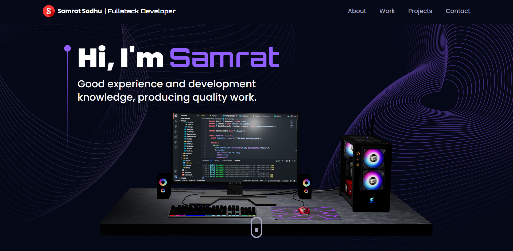

# 3D Portfolio Website

A 3D personal portfolio website build with react and three js.



<!-- TABLE OF CONTENTS -->
<details>
  <summary>Table of Contents</summary>
  <ol>
    <li>
      <a href="#about-the-project">About The Project</a>
      <ul>
        <li><a href="#built-with">Built With</a></li>
      </ul>
    </li>
    <li>
      <a href="#getting-started">Getting Started</a>
      <ul>
        <li><a href="#prerequisites">Prerequisites</a></li>
        <li><a href="#installation">Installation</a></li>
      </ul>
    </li>
    <li><a href="#features">Features</a></li>
    <li><a href="#contributing">Contributing</a></li>
    <li><a href="#license">License</a></li>
    <li><a href="#view-demo">View Demo</a></li>
    <li><a href="#contact">Contact</a></li>
  </ol>
</details>

### Built With

-   [React](https://reactjs.org/)
-   [Tailwind CSS](https://tailwindcss.com/)
-   [Speechly](https://www.speechly.com/)

## Getting Started

### Installation

_Follow the following steps to install and setup the environment._

1. Clone the repo
    ```sh
    git clone https://github.com/Samrat-14/my-portfolio-3d.git
    ```
2. Once inside the cloned repo, get started with installing the node modules.
    ```sh
    npm install
    ```
3. Start the server for frontend.
    ```sh
    npm start
    ```
4. After the installments are over, you can get started with the project.

## Features

-   3D models rendered using ThreeJs library.
-   Amazing graphics with interactive models in a presentable format.
-   3D animations in Contact page and usage of Framer motion for other smooth effects.
-   Functional contact me page with EmailJs to serve the communication.

## Contributing

I love contributions, so please feel free to fix bugs, improve things, provide documentation.
If you have a suggestion that would make this better, please fork the repo and create a pull request. You can also simply open an issue with the tag "enhancement".
Don't forget to give the project a star! Thanks again!

1. Fork the Project
2. Create your Feature Branch (`git checkout -b feature/AmazingFeature`)
3. Commit your Changes (`git commit -m 'Add some AmazingFeature'`)
4. Push to the Branch (`git push origin feature/AmazingFeature`)
5. Open a Pull Request

<!-- LICENSE -->

## License

Distributed under the MIT License. See `LICENSE` for more information.

## View Demo

Live Demo: [https://my-portfolio-3d.netlify.app/](https://my-portfolio-3d.netlify.app/)

## Contact

[Samrat Sadhu](https://samrat-14.github.io/my-portfolio/) - ss2414@ece.jgec.ac.in
